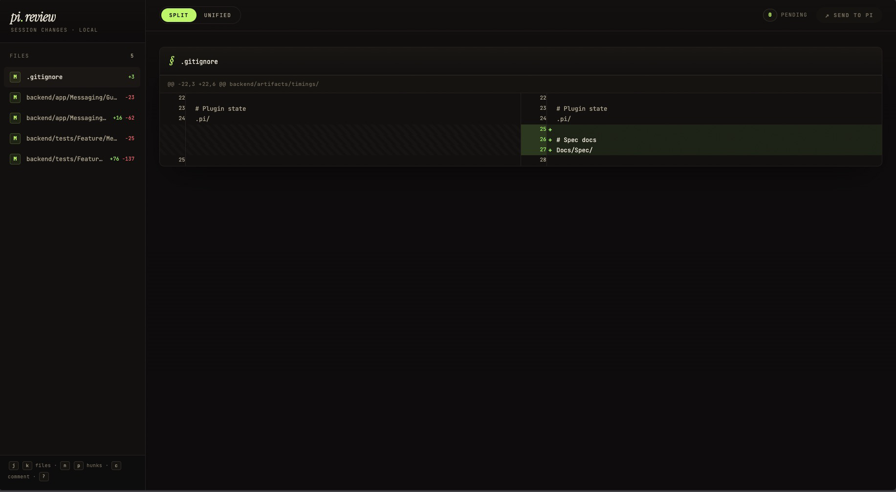
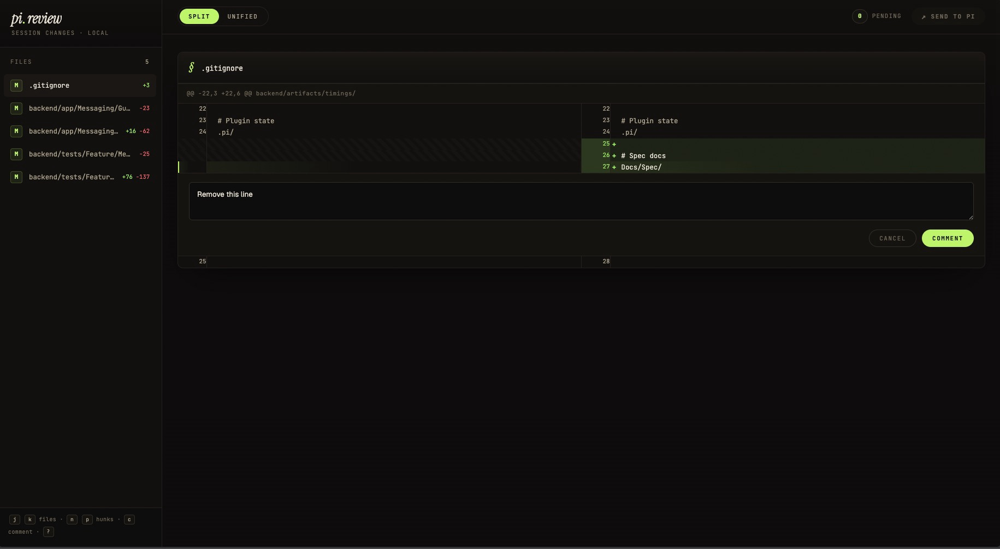

# pi-session-review

**Review pi's code changes in your browser. Comment on specific lines. Send feedback directly back to pi.**

## The Problem

You ask pi to write code. It writes code. But reviewing what it changed means scrolling through terminal output, squinting at diffs, and typing vague feedback like "fix the auth function." You can't point at a specific line. You can't annotate. You're describing locations instead of showing them.

## What This Does

`/changes` opens a browser-based diff viewer for your current pi session. It shows every file pi touched, with a side-by-side diff. Click any line and hit **COMMENT** to leave feedback. When you're done, hit **SEND TO PI** — pi receives them as a structured follow-up message with file paths and line numbers.

No more "the thing on line 42." Just click line 42, type, done.



## What is pi?

[Pi](https://pi.dev) is a terminal-based coding agent. You describe what you want, pi writes the code. It runs in your terminal, reads your files, executes commands, and iterates until the task is done.

This extension adds a review layer on top of that workflow.

## Install

```bash
pi install git:github.com/masnun-siam/pi-session-review
```

## How to Use

1. Ask pi to do something — build a feature, fix a bug, refactor a module
2. When pi finishes, run `/changes`
3. Browser opens with a diff view of everything pi changed
4. Click a line number — a text field appears
5. Type your feedback, hit **COMMENT** — comment is queued
6. Repeat across files and lines as needed
7. When done, click **SEND TO PI** — all comments delivered at once



```
You:  "Add user authentication with JWT"
pi:   *writes 15 files*
You:  /changes
      → browser opens with diff view
      → click line 42 in auth.ts → text field appears
      → type "use bcrypt.compare instead of ==="
      → hit COMMENT → comment queued
      → click line 87 in routes.ts → text field appears
      → type "add rate limiting here"
      → hit COMMENT → comment queued
      → repeat for other files...
      → hit SEND TO PI
pi:   receives all comments, addresses each one
```

## Features

- **Git-based diffs** — shows `git diff HEAD` for tracked changes, full diff for new files
- **Line-level comments** — click any line, type feedback
- **Live refresh** — updates automatically when files change on disk
- **Batch delivery** — all comments sent as one structured message to pi
- **Session-scoped** — comments persist per session, stored in `~/.pi/agent/sessions/`

## License

MIT
